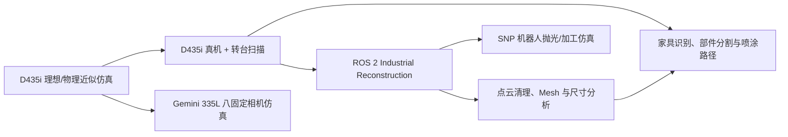

# RGB-D 三维重建与机器人喷涂工作区

本仓库汇总了项目从 Intel RealSense D435/D435i 单相机验证、真实转台扫描、ROS 2 工业 TSDF 重建，到 Orbbec Gemini 335L 八固定相机仿真和家具喷涂处理的完整实验过程。

仓库不是一个单独可执行程序，而是由多个相互关联的子项目、验证工具和第三方参考代码组成。新使用者应先根据目标选择对应目录，不要直接从仓库根目录批量运行所有脚本。

## 当前推荐入口

如果目标是验证“8 台 Gemini 335L 固定相机拍摄车辆并通过 TSDF 拼接”的当前方案，请从这里开始：

- [Gemini 335L 八相机仿真](gemini335l_multicam_sim/README.md)
- [8 台 Gemini 335L ChArUco 实机标定方法](gemini335l_multicam_sim/CHARUCO_CALIBRATION.md)
- 一键运行：`./gemini335l_multicam_sim/run_validation.sh`
- 网页查看：`gemini335l_multicam_sim/viewer.html`

该项目使用 PyBullet 生成 RGB-D、Open3D `ScalableTSDFVolume` 融合，并提供理想数据与规格书推导噪声两组结果。

## 项目演进关系



各阶段解决的问题不同：

1. `d435i_tsdf_sim` 验证相机几何、视角数量、TSDF 参数和理论上限。
2. `real_scan` 验证 D435i、机械臂与转台上的真实采集、分割和重建。
3. `industrial_reconstruction-main` 将实时 RGB-D 和 TF 位姿接入 ROS 2 TSDF。
4. `gemini335l_multicam_sim` 验证新方案中的 8 台 Gemini 335L 固定相机布局。
5. `furniture_spray_deploy` 对家具进行分类、部件分割和喷涂路径规划。
6. `snp-automate-2023-polishing-simulation-main` 验证重建 Mesh 到机器人加工轨迹的仿真流程。

## 目录导航

| 路径 | 类型 | 主要内容 | 建议用途 |
| --- | --- | --- | --- |
| [`gemini335l_multicam_sim/`](gemini335l_multicam_sim/README.md) | 当前主线 | 8 台固定 Gemini 335L、汽车模型、RGB-D、TSDF、误差评估和网页查看器 | 验证当前多相机方案 |
| [`d435i_tsdf_sim/`](d435i_tsdf_sim/README.md) | 仿真与实验基线 | D435i URDF、PyBullet/Open3D TSDF、椅子和复杂书桌、多视角数量及噪声实验 | 分析 D435 理论上限与 TSDF 参数 |
| [`industrial_reconstruction-main/`](industrial_reconstruction-main/README.md) | ROS 2 工程 | 实时 RGB-D + TF → Open3D TSDF；本仓库版本包含真机话题、RViz 和帧队列调整 | 接入真实相机和机械臂 |
| [`项目文件夹(1)/项目文件夹/real_scan/`](项目文件夹%281%29/项目文件夹/real_scan/README.md) | 真机实验档案 | D435i + ECO65-B + Y200RA60 转台；包含 V1–V22 多轮方案、YOLO/SAM、COLMAP、Visual Hull、TSDF | 复现实机转台扫描和查看历史迭代 |
| [`项目文件夹(1)/项目文件夹/furniture_spray_deploy/`](项目文件夹%281%29/项目文件夹/furniture_spray_deploy/README.md) | 部署工程 | Flask 服务、家具分类、PointNeXt/PointCNN 部件分割和喷涂路径规划 | 部署家具喷涂 Web 服务 |
| [`point-cloud-mesh-surface-analysis-main/`](point-cloud-mesh-surface-analysis-main/README.md) | Python 工具包 | 点云清理、平面/聚类分析、表面重建和 Mesh 质量报告 | 对扫描结果做通用后处理 |
| [`snp-automate-2023-polishing-simulation-main/`](snp-automate-2023-polishing-simulation-main/README.md) | ROS 2/Docker 仿真 | 扫描、重建、区域选择、工具路径和虚拟机器人执行 | 验证 Mesh 到加工轨迹的完整链路 |
| [`WorldSculpt/`](WorldSculpt/README.md) | 第三方研究代码 | AlayaLab WorldSculpt 场景 Mesh 生成代码；保留本机兼容性小改动 | 研究生成式场景建模 |
| [`Some-implementions-with-RGBD-camera-RealSense-D435-master/`](Some-implementions-with-RGBD-camera-RealSense-D435-master/README.md) | 第三方参考 | D435 采集、双相机配准、PointNet 和 DenseFusion 示例 | 查阅早期 RealSense 实现 |

仓库根目录的中文 Markdown/PDF 文件记录团队分工、技术重难点和项目规划。

## 当前 Gemini 335L 方案摘要

当前主线采用 8 台固定 Gemini 335L：上层 4 台、下层 4 台，围绕静止车辆顺序采集。默认快速仿真分辨率为 640×400，采用规格书 1280×800 内参的 0.5 倍缩放。

```text
8 路 RGB-D
  → 按固定外参转换到世界坐标
  → Open3D ScalableTSDFVolume
  → PLY / OBJ Mesh
  → 与米制真值模型比较尺寸、表面误差和完整度
```

当前已提交的理想数据结果中，重建到真值表面的平均距离约 5.85 mm，P95 约 14.08 mm；规格书推导噪声下平均距离约 6.54 mm，P95 约 15.96 mm。完整定义和结果边界见其独立 README。

## D435/D435i 仿真内容

`d435i_tsdf_sim` 保存了项目早期到中期的大量受控实验：

- 解析深度与 PyBullet RGB-D 两种输入方式。
- Intel RealSense 官方 D435/D435i URDF/网格资源。
- Open3D `ScalableTSDFVolume`，不是自写 TSDF 后端。
- 理想深度、D435 双目基线和视差量化近似。
- 椅子、杯子、复杂书桌/书架等不同复杂度目标。
- 10、15、20、30、40 个视角的覆盖率对比。
- 深度噪声和相机位姿误差实验。
- 重建表面到真值、真值到重建、包围盒和完整度评估。

建议先阅读：

- [`D435_LIMIT_RESULTS.md`](d435i_tsdf_sim/D435_LIMIT_RESULTS.md)
- [`VIEW_COUNT_RESULTS.md`](d435i_tsdf_sim/VIEW_COUNT_RESULTS.md)
- [`COMPLEX_DESK_RESULTS.md`](d435i_tsdf_sim/COMPLEX_DESK_RESULTS.md)

完整高精度 `tsdf_mesh.ply` 单文件超过 GitHub 普通 Git 限制，因此不提交；对应 `report.json`、RGB/深度帧、真值和轻量 `viewer_mesh.ply` 保留在仓库中，可直接查看或重新生成完整 Mesh。

## 真实 D435i + 转台扫描

真实扫描工程位于 `项目文件夹(1)/项目文件夹/real_scan`。硬件组合为：

- 瑞尔曼 ECO65-B 机械臂。
- Intel RealSense D435i 深度相机。
- Y200RA60 电动转台。
- 微型椅子、桌子和柜子。

该目录是实验档案，保留了 V1–V22 的多个方案。当前入口和历史结论分别见：

- `README.md`：早期稳定的 `final.py` 采集与拼接流程。
- `VERSIONS.md`：各版算法、结果和失败原因。
- `V12README.md`：YOLO + Hyper3D + Blender 的 V12 管线。
- `scan_recon_v*.py`：后续 Visual Hull、COLMAP、纯深度和 TSDF 实验。

这部分代码中包含会控制真实串口转台、RealSense 和机械臂的脚本。运行前必须检查设备、串口、运动范围和急停状态。

## 根目录真机工具

根目录另外保存了一套 ROS 2 + RealSense + 固定机械臂/转台 TSDF 工具：

| 文件 | 功能 |
| --- | --- |
| [`rs_publisher.py`](rs_publisher.py) | 读取 D435，做空间/时间/孔洞滤波并发布 ROS 2 RGB、深度和内参 |
| [`mark_turntable_center.py`](mark_turntable_center.py) | 在 RGB 图上点击转台中心，并通过 TF 转换到 `baselink` |
| [`turntable_reconstruction.py`](turntable_reconstruction.py) | 固定相机、自动转台、多角度 RGB-D TSDF 重建 |
| `run_direction_test_*.sh` | 用两个方向做 0°/180°转向检查 |
| `run_direction_crop*.sh` | 4 或 12 视角裁剪采集 |
| `industrial_reconstruction_config.rviz` | 真机调试时使用的独立 RViz 配置副本 |

详细依赖、坐标关系和安全注意事项见 [`REAL_HARDWARE_TOOLS.md`](REAL_HARDWARE_TOOLS.md)。

## ROS 2 Industrial Reconstruction 改动

`industrial_reconstruction-main` 基于 ROS-Industrial 的 Open3D 重建工程。本地版本相对原始代码的关键调整包括：

- 深度话题改为 `/camera/aligned_depth_to_color/image_raw`。
- 彩色话题改为 `/camera/color/image_raw`。
- RViz 固定坐标改为 `baselink`。
- Mesh/TSDF 显示使用 `Transient Local`。
- 移除固定延迟 30 帧后才查询 TF 的队列行为，降低眼在手上运动时的位姿错配。
- 诊断阶段最多保存 100 帧，避免图像队列阻塞停止服务。

这些改动是当前真机诊断配置，不代表通用最优参数。用于其他设备时应重新检查话题、TF、帧数和 QoS。

## 家具喷涂部署工程

`furniture_spray_deploy` 包含：

- Flask Web 前端和 API。
- ResNet-18 家具分类权重。
- PointNeXt 柜子部件分割。
- PointCNN 椅子/桌子部件分割。
- 点云喷涂路径规划与导出。
- OpenPoints 和 Ultralytics 的项目内依赖副本。

两个接近 100 MB 的 PointCNN checkpoint 已保留，以保证椅子/桌子分割模块可用。运行和内存要求见其目录内 README。

## 环境不是统一的

不同子项目形成于不同实验阶段，不能共用一个固定 Python/ROS 环境：

| 子项目 | 主要环境 |
| --- | --- |
| Gemini 335L 仿真 | Python 3.12、Open3D 0.19、PyBullet |
| D435i 仿真 | Python、Open3D、PyBullet；部分基础测试不需要 ROS |
| 真机转台扫描 | Python 3.10/3.12、pyrealsense2、Open3D、OpenCV、YOLO、串口 |
| Industrial Reconstruction | ROS 2、Open3D、TF2、cv_bridge |
| SNP 仿真 | ROS 2 Jazzy、Docker/Compose、RViz |
| 家具喷涂 Web 服务 | Python 3.8–3.10、PyTorch、TensorFlow 1.x 兼容层、Flask |
| WorldSculpt | CUDA/PyTorch 和上游指定的大模型环境 |

请优先按照各子目录 README 创建独立虚拟环境，不要提交或复制本机 `.venv`。

## 未纳入 Git 的本机工件

以下文件仍保留在开发机器上，但因体积、可再生成性或安全性不提交到普通 Git：

| 本机路径/类型 | 原因 | 恢复方式 |
| --- | --- | --- |
| 根目录和 `real_scan` 的 `.venv/` | 合计约 16 GB，包含平台相关 Python/CUDA 二进制 | 按各项目 README 重建环境 |
| `WorldSculpt/offline_wheels/` | 约 2.7 GB CUDA/PyTorch 离线安装包 | 使用上游安装命令或重新下载 wheel |
| `d435i_tsdf_sim/output*/tsdf_mesh.ply` | 32 个完整 Mesh 合计约 1.37 GB，部分单文件超过 100 MB | 使用对应脚本和报告参数重新运行；仓库保留轻量 Mesh |
| `real_scan/sam_vit_b_01ec64.pth` | 375 MB、可公开下载，且默认流程不需要 SAM | 从 Meta Segment Anything 官方地址下载 |
| `real_scan/output/**/pcd_frames/` | 逐帧密集点云约 318 MB，是可再生成中间结果 | 重新执行采集或解压本地归档 |
| `WorldSculpt` 离线缓存、压缩包、`.deb` | 下载缓存或系统安装包 | 由包管理器重新安装 |
| `d435i_tsdf_sim/official_realsense_ros/` | 与已提交的 `official_full` 源快照重复 | 从 IntelRealSense/realsense-ros 拉取提交 `9a11121` |

SAM ViT-B 官方权重地址：

```text
https://dl.fbaipublicfiles.com/segment_anything/sam_vit_b_01ec64.pth
```

## 快速验证

### Gemini 335L 当前主线

```bash
python3 -m venv .venv
./.venv/bin/python -m pip install open3d==0.19.0 pybullet==3.2.7 numpy pillow
./gemini335l_multicam_sim/run_validation.sh
```

### 点云/Mesh 工具包

```bash
cd point-cloud-mesh-surface-analysis-main
python3 -m venv .venv
.venv/bin/pip install -r requirements.txt
.venv/bin/pip install -e .
make test
```

### 查看 Gemini 已提交结果

```bash
python3 -m http.server 8877 \
  --bind 127.0.0.1 \
  --directory gemini335l_multicam_sim
```

浏览器打开 `http://127.0.0.1:8877/viewer.html`。

## 数据、坐标和尺度约定

- 仿真和重建几何默认使用米。
- 深度 PNG 常以 `uint16` 毫米保存，进入 Open3D 前必须按深度比例转换。
- Open3D TSDF 使用 `world_to_camera` 外参；不要误传 `camera_to_world`。
- RealSense 对齐深度发布到彩色光学坐标后，深度、RGB 和 CameraInfo 必须使用一致 frame。
- 转台方案需要绕真实转轴中心旋转物体位姿；只按世界原点旋转会产生重影。
- 仿真结果包含实际尺寸，但规格书参数不能代替实机逐台标定。

## 安全提醒

- 仿真目录可以离线运行，不会控制真实硬件。
- `real_scan`、根目录转台脚本和机械臂脚本可能访问串口、相机或发送运动命令。
- 真机运行前确认转台上无障碍物、机械臂保持安全姿态、线缆有足够余量且急停可用。
- 不要在不了解脚本默认角度、速度、裁剪范围和串口设备时直接执行批处理脚本。
- 远程控制设备时不要把密码、API key、SSH 私钥或 `.env` 提交到仓库。

## 第三方来源与许可证

仓库包含或参考多个上游项目，使用时应分别遵守各自许可证：

- Orbbec `OrbbecSDK_ROS2`：Gemini 335L/336L STL 与 Xacro，Apache 2.0。
- IntelRealSense `realsense-ros`：D435/D435i ROS 资源及其原始许可证。
- Khronos `glTF-Sample-Assets` Car Concept：CC BY 4.0。
- ROS-Industrial `industrial_reconstruction` 与 `snp_automate_2023`：见各自目录许可证。
- AlayaLab `WorldSculpt`：Apache 2.0，另见其 `NOTICE` 与第三方许可证。
- Ultralytics 副本：见 `furniture_spray_deploy/ultralytics/LICENSE`。
- `Some-implementions-with-RGBD-camera-RealSense-D435-master` 是第三方参考代码；其目录未提供明确根许可证，重新分发或商用前应核实原作者授权。

## 仓库维护原则

- 源码、配置、参数、报告、必要模型和可查看结果进入 Git。
- 虚拟环境、CUDA 二进制、下载缓存、构建目录和可再生成的大型中间结果不进入 Git。
- 新增真实设备参数时注明是规格书值、实机读取值还是标定结果。
- 新增重建结果时同时保存运行参数和量化报告，避免只凭截图判断效果。
