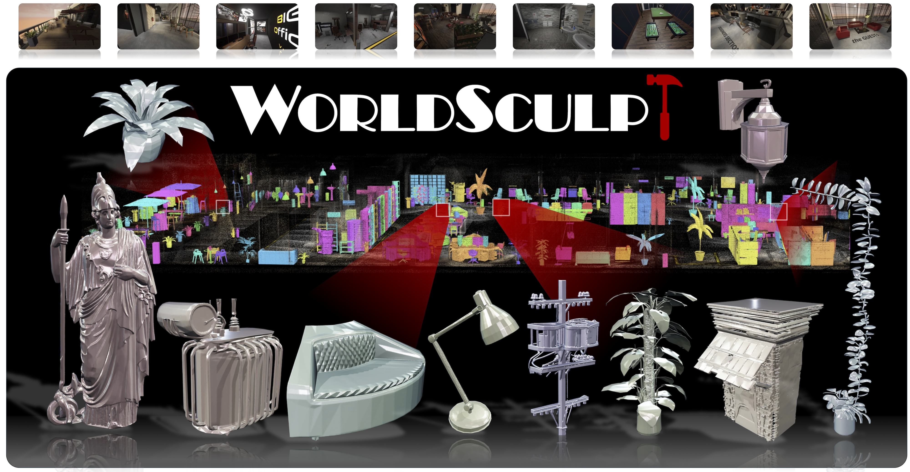

<!-- <div align="center"> -->

<!-- # WorldSculpt: Generative Compositional Scene Meshification from Multiple Images -->

<h1 align="center">WorldSculpt: Generating Compositional Worlds
from Grounded Videos</h1>


<!-- <h3>arXiv 2026</h3> -->

<div align="center">
    <a href='https://myniuuu.github.io/' target='_blank'>Muyao Niu</a><sup>1,2</sup> &nbsp;
    <a href='https://kakituken.github.io/home' target='_blank'>Jixuan He</a><sup>1</sup> &nbsp;
    <a href='https://auroraryan0301.github.io/' target='_blank'>Ruihan Yu</a><sup>1</sup> &nbsp;
    <a href='https://scholar.google.com/citations?user=CbWYuIEAAAAJ' target='_blank'>Lian Fu</a><sup>1</sup> &nbsp;
    <a href='https://scholar.google.com/citations?user=lwuwuAYAAAAJ' target='_blank'>Yonghao Yu</a><sup>1</sup> &nbsp;
    <a href='https://brian90709.github.io/' target='_blank'>Zheng-Hui Huang</a><sup>1</sup> &nbsp;
    <a href='https://yifever20002.github.io/' target='_blank'>Yifan Zhan</a><sup>1</sup> &nbsp;
    <a href='https://openreview.net/profile?id=%7EFengbo_Lan1' target='_blank'>Fengbo Lan</a><sup>1</sup> &nbsp;
</div>
<div align="center">
    <a href='https://yongtao.me/' target='_blank'>Yongtao Ge</a><sup>1</sup> &nbsp; 
    <a href='https://scholar.google.com/citations?user=JD-5DKcAAAAJ' target='_blank'>Yinqiang Zheng</a><sup>2</sup> &nbsp; 
    <a href='https://kpzhang93.github.io/' target='_blank'>Kaipeng Zhang</a><sup>1,✉</sup> &nbsp; 
    <a href='https://lightchaserx.github.io/' target='_blank'>Zhixiang Wang</a><sup>1,✉</sup> &nbsp; 
</div>
<div align="center">
    <sup>1</sup> Alaya Lab &nbsp; <sup>2</sup> The University of Tokyo &nbsp; <sup>✉</sup> Corresponding Authors &nbsp; 
</div>

<!-- </div> -->

<div align="center">
  <a href="https://alaya-lab.github.io/WorldSculpt"></a>
  <a href="https://arxiv.org/abs/2609.05416"></a>
  <a href="https://huggingface.co/AlayaLab/WorldSculpt"></a>
  <a href="https://huggingface.co/datasets/AlayaLab/Worldsculpt_data"></a>
  <a href="https://alaya-lab.github.io/WorldSculpt/#video"></a>
   <a href="LICENSE"></a>
</div>

<div align="center">
    
</div>

<div align="center">Given RGB images with instance masks and 3D boxes, <strong>WorldSculpt</strong> produces a compositional mesh representation for very complex scenes consisting of hundreds of individual objects.</div>

<!-- **TL;DR — What We Do** -->

<h2>TL;DR</h2>

- **Single-object prior for complex compositional scenes.** We demonstrate that a single-object generative prior can be leveraged for compositional meshification of very complex scenes with hundreds of objects.
- **Adapting Single-Object Prior.** We finetune Pixal3D to consume occluded multiple-view input.
- **Benchmark.** We release the UE-MeshyScene dataset with per-frame, per-instance annotations.
- **Application to Marble.** The same pipeline turns a Marble 3DGS world into object-level compositional meshes.


## 🧭 Pipeline

<div align="center">
    
</div>


## ✨ News

- **Sep 2026**: Release inference codes 📟, checkpoint 🤗, arXiv 📚, and project page 🏠.


## 🚀 Getting Started

### Installation

#### Step 1: Following TRELLIS.2 Installation

Please first follow the installation guide of [TRELLIS.2](https://github.com/microsoft/TRELLIS.2) to set up the base environment.

#### Step 2: Installing Additional Dependencies

`NATTEN_CUDA_ARCH` is the compute capability of your GPU. Print yours with
```bash
python -c "import torch; print('%d.%d' % torch.cuda.get_device_capability())"
```

```bash
# H100; replace 9.0 with your own compute capability
NATTEN_CUDA_ARCH="9.0" NATTEN_N_WORKERS=8 pip install natten==0.21.0 --no-build-isolation
pip install https://github.com/LDYang694/Storages/releases/download/20260430/utils3d-0.0.2-py3-none-any.whl
pip install peft pillow imageio imageio-ffmpeg tqdm easydict opencv-python-headless trimesh transformers==4.57.1 zstandard kornia timm diffusers accelerate gradio plyfile matplotlib scikit-image scikit-learn fpsample iopath pycocotools ftfy
pip install "setuptools<81"
```

#### Step 3: Downloading Pretrained Checkpoints

```bash
hf download AlayaLab/WorldSculpt --local-dir ./pretrained
hf download TencentARC/Pixal3D --local-dir ./pretrained/Pixal3D
```

#### Step 4: Downloading Data

```bash
# UE-MeshyScene
hf download AlayaLab/WorldSculpt_data --include "UE-MeshyScene/*" --local-dir ./input --repo-type=dataset
cd ./input/UE-MeshyScene
tar xvf scene*.tar
cd ../..

# Marble DEMO data
hf download AlayaLab/WorldSculpt_data --include "Marble/*" --local-dir ./input --repo-type=dataset
cd ./input/Marble
tar xvf Marble.tar.gz
cd ../..
```

#### Step 5 🚀🚀: Running Inference

Every option is passed explicitly — the script has no defaults, so a run is fully
described by its own command line. Step 4 extracts each dataset into its own
subdirectory, so `INPUT_ROOT` points at that subdirectory, not at `./input`
(the script reads `$INPUT_ROOT/<scene>/transforms.json`).

```bash
# UE-MeshyScene, scene_00001
INPUT_ROOT=./input/UE-MeshyScene OUTPUT_ROOT=./output CKPT_ROOT=./pretrained \
SAMPLER=official SS_STEP=15000 SHAPE_STEP=15000 \
RENDER=1 FACE_BUDGET=1000000 GPU=0 \
./inference.sh scene_00001

# Marble demo data, marble_serene_living_room_countryside_view
INPUT_ROOT=./input/Marble OUTPUT_ROOT=./output CKPT_ROOT=./pretrained \
SAMPLER=official SS_STEP=15000 SHAPE_STEP=15000 \
RENDER=1 FACE_BUDGET=1000000 GPU=0 \
./inference.sh marble_serene_living_room_countryside_view
```

## 🙏 Acknowledgements

We thank [Pixal3D](https://huggingface.co/TencentARC/Pixal3D), [TRELLIS.2](https://github.com/microsoft/TRELLIS.2), and [DINOv3](https://github.com/facebookresearch/dinov3) for their wonderful work and open-source repositories.

## 📖 Citation

If you find this work useful, please cite:

```bibtex

@misc{niu2026worldsculptgeneratingcompositionalworlds,
      title={WorldSculpt: Generating Compositional Worlds from Grounded Videos}, 
      author={Muyao Niu and Jixuan He and Ruihan Yu and Lian Fu and Yonghao Yu and Zheng-Hui Huang and Yifan Zhan and Fengbo Lan and Yongtao Ge and Yinqiang Zheng and Kaipeng Zhang and Zhixiang Wang},
      year={2026},
      eprint={2609.05416},
      archivePrefix={arXiv},
      primaryClass={cs.CV},
      url={https://arxiv.org/abs/2609.05416}, 
}

```

