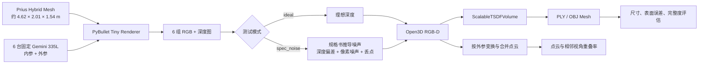

# Gemini 335L 六固定相机 TSDF 重建仿真

本项目用于在可控的纯仿真环境中，验证“6 台固定深度相机采集 → 多视角点云拼接 → TSDF 融合 → Mesh 输出”这条三维重建链路。

仿真相机按 Orbbec Gemini 335L 的规格书参数配置，默认场景目标为新增的 Gazebo Prius Hybrid 车辆模型。项目同时提供无噪声基线和规格书推导噪声两组结果，并提供“模板 Mesh → 模板点云 → 现场点云”的配准回归，用于验证车辆定位而不只是验证 TSDF 重建。

> 重要：这是算法与系统布局仿真，不是 6 台 Gemini 335L 实机的逐机标定复现。规格书中的典型值不能替代实机内参、畸变参数、深度标定和多相机外参。

## 1. 项目目标

- 验证 6 个固定视角能否覆盖车辆可见外表面。
- 验证固定外参条件下，多视角 RGB-D 数据能否正确进入 TSDF。
- 检查重建 Mesh 是否保留真实米制尺寸。
- 对比理想深度与规格书推导噪声下的精度变化。
- 为后续替换成 Gemini 335L 实机数据提供可复现基线。

当前重建核心使用 Open3D 已实现的 `ScalableTSDFVolume`，并非项目自行实现 TSDF 数值积分算法。

## 2. 技术链路



主要步骤如下：

1. 加载高细节汽车模型，并统一到 `4.80 × 2.05 × 1.55 m` 的真实车辆包围盒。
2. 在 PyBullet DIRECT 模式下，从 6 个固定机位渲染 RGB 和深度图。
3. 将 OpenGL 深度缓冲转换为米制深度，并量化为 1 mm 深度单位。
4. 可选加入规格书推导的深度噪声和模拟外参误差。
5. 使用相机内参生成 Open3D RGB-D 与单相机点云。
6. 使用固定外参把各相机点云变换到统一世界坐标系。
7. 使用 Open3D `ScalableTSDFVolume` 融合 6 帧 RGB-D。
8. 提取三角网格，删除极小孤立面片，并输出 PLY、OBJ 和评估报告。

## 3. 相机参数

参数保存在 [`gemini335l_spec.json`](gemini335l_spec.json)。参数来自用户提供的《Gemini335L 精简规格书》，配置文件中的 `source_file` 仅记录原始文档在开发机器上的来源路径；运行仿真不需要该 Word 文档。

### 3.1 规格书参数

| 参数 | 当前配置 |
| --- | ---: |
| 相机型号 | Orbbec Gemini 335L |
| 原生深度分辨率 | 1280 × 800 @ 30 FPS |
| 典型内参 | `fx=620, fy=620, cx=640, cy=400` px |
| 典型深度 FOV | 水平 90°，垂直 65° |
| 双目基线 | 95 mm |
| 深度单位 | 1 mm |
| 理想工作距离 | 0.25–6.0 m |
| 宽工作距离 | 0.17–20.0 m |
| 深度精度上限 | 2 m 处 ≤1%，4 m 处 ≤2% |
| 空间精度上限 | 2 m 处 ≤0.8%，4 m 处 ≤1.6% |
| 2 m 时间精度 | ≤0.4% |
| 2 m 填充率 | ≥99.5% |
| 快门 | Global Shutter |
| 多相机同步 | 支持 |

这些值属于产品规格书的典型值或上限，不是某一台实机 EEPROM 中读取出的标定值。

### 3.2 默认仿真参数

为降低验证时间，默认使用原生参数的精确 0.5 倍缩放：

| 参数 | 默认值 |
| --- | ---: |
| 分辨率 | 640 × 400 |
| `fx, fy` | 310, 310 px |
| `cx, cy` | 320, 200 px |
| 由内参计算的 FOV | 水平 91.82°，垂直 65.66° |
| 渲染近/远裁剪面 | 0.17 / 8.0 m |
| TSDF voxel | 15 mm |
| TSDF truncation | 60 mm |

使用 `--full-resolution` 可切换到 1280 × 800，但内存占用和运行时间会明显增加。

### 3.3 相机外观模型

场景显示使用 Orbbec 官方 `OrbbecSDK_ROS2` 仓库中的 Gemini 335L/336L：

- `base_link.STL`
- `gemini_335_L_336_L.urdf.xacro`

脚本依据官方 Xacro 中的视觉原点，将 STL 从 ROS 相机坐标转换到深度光学坐标。网页中的 `×4` 相机仅用于方便观察，不改变真实相机中心、拍摄方向或重建结果。

## 4. 六相机布局与坐标系

世界坐标系使用米为单位：

- `X`：车辆长度方向，`+X` 为命名中的 front。
- `Y`：车辆宽度方向，`+Y` 为命名中的 left。
- `Z`：竖直向上。
- 深度光学坐标：`X` 向右、`Y` 向下、`Z` 向前。

默认 6 台相机采用“4 台高位四角 + 2 台低位中侧”的部署方案。高位相机负责整车外形和端面约束，低位中侧相机负责轮拱、门槛和接地点等对纵向位姿更敏感的区域。采集顺序为 `cam01` 到 `cam06`，仿真目标在采集期间保持静止。

| 相机 | 层级/位置 | 相机中心 `(X,Y,Z)` m | 注视点 `(X,Y,Z)` m |
| --- | --- | --- | --- |
| cam01 | upper front-left | `( 3.60,  2.60, 2.45)` | `( 1.05, 0, 1.06)` |
| cam02 | upper rear-left | `(-3.60,  2.60, 2.45)` | `(-1.05, 0, 1.06)` |
| cam03 | upper rear-right | `(-3.60, -2.60, 2.45)` | `(-1.05, 0, 1.06)` |
| cam04 | upper front-right | `( 3.60, -2.60, 2.45)` | `( 1.05, 0, 1.06)` |
| cam05 | lower middle-left | `( 0.00,  1.35, 0.72)` | `( 0.00, 0, 0.82)` |
| cam06 | lower middle-right | `( 0.00, -1.35, 0.72)` | `( 0.00, 0, 0.82)` |

脚本仍支持 `--camera-layout eight` 运行原来的 4 高位 + 4 低位布局，便于和历史 8 相机结果对比；默认和网页结果均为 6 相机。

每次运行产生的真实外参、实际用于积分的外参和相机中心都会写入 `poses.json`。

## 5. 目录结构

```text
gemini335l_multicam_sim/
├── assets/
│   ├── car_concept/              # Khronos 高细节汽车 GLB、来源与许可证
│   └── gemini335l_official/      # Orbbec 官方 STL、Xacro、来源与许可证
├── output_ideal/                 # 精确外参、无传感器噪声结果
├── output_spec_noise/            # 规格书推导深度噪声结果
├── gemini335l_spec.json           # 相机规格及仿真分辨率
├── simulate_8cam_reconstruction.py # 默认六相机，也支持 --camera-layout eight
├── run_validation.sh             # 顺序生成两组默认结果
├── viewer.html                   # Three.js 对比查看器
└── README.md
```

## 6. 环境准备

当前结果已在以下环境验证：

- Ubuntu Linux
- Python 3.12.3
- Open3D 0.19.0
- PyBullet 3.2.7
- NumPy 2.5.2
- Pillow 12.3.0

从仓库根目录执行：

```bash
python3 -m venv .venv
./.venv/bin/python -m pip install --upgrade pip
./.venv/bin/python -m pip install open3d==0.19.0 pybullet==3.2.7 numpy pillow
```

`run_validation.sh` 默认使用仓库根目录下的 `.venv/bin/python`。如需使用其他 Python 环境，可直接执行 Python 入口脚本。

## 7. 运行仿真

### 7.1 一键生成默认对照组

在仓库根目录执行：

```bash
./gemini335l_multicam_sim/run_validation.sh
```

脚本依次在 `gemini335l_multicam_sim/` 目录下生成：

1. `gemini335l_multicam_sim/output_ideal`：精确外参、无传感器噪声。
2. `gemini335l_multicam_sim/output_spec_noise`：精确外参、规格书推导深度噪声。

默认对照组没有加入相机定位误差，使用六相机布局。

### 7.2 单独运行理想场景

```bash
./.venv/bin/python gemini335l_multicam_sim/simulate_8cam_reconstruction.py \
  --output gemini335l_multicam_sim/output_ideal \
  --depth-model ideal \
  --camera-layout six
```

### 7.3 运行规格书噪声场景

```bash
./.venv/bin/python gemini335l_multicam_sim/simulate_8cam_reconstruction.py \
  --output gemini335l_multicam_sim/output_spec_noise \
  --depth-model spec_noise \
  --noise-seed 335 \
  --camera-layout six
```

噪声模型包含：

- 随距离变化的帧级深度偏差。
- 将 2 m 处 1%、4 m 处 2% 的精度上限近似视为 `3σ` 后产生的逐像素高斯噪声。
- 按 99.5% 填充率模拟的随机丢点。
- 1 mm 深度量化。

该模型不是实机采样得到的噪声分布，也没有模拟红外串扰、反光、多路径和阳光干扰。

### 7.4 加入相机定位/标定误差

```bash
./.venv/bin/python gemini335l_multicam_sim/simulate_8cam_reconstruction.py \
  --output gemini335l_multicam_sim/output_pose_noise \
  --depth-model spec_noise \
  --pose-noise \
  --pose-translation-sigma-mm 3.0 \
  --pose-rotation-sigma-deg 0.10 \
  --pose-seed 336 \
  --camera-layout six
```

位姿误差按每台相机、每个平移轴和旋转轴独立采样。实际采样值会记录到 `report.json` 和 `poses.json`。

### 7.5 其他常用选项

```text
--full-resolution                  使用 1280×800
--voxel 0.015                     TSDF 体素边长，单位 m
--trunc 0.060                     TSDF 截断距离，单位 m
--vehicle-model prius_hybrid      使用 models/ 中的 Prius Hybrid 模型（默认）
--vehicle-model car_concept       使用下载的高细节 Car Concept 模型
--vehicle-model procedural        使用脚本生成的简化 SUV
--vehicle-asset PATH              替换车辆 OBJ/GLB 资产
--camera-mesh PATH                替换相机 STL
--camera-layout six|eight         六相机默认方案，或运行历史八相机基线
```

减小 `--voxel` 通常能保留更多细节，但会显著增加内存和计算量；`--trunc` 应结合深度噪声和体素尺寸调整。

## 8. 模板车与现场车配准仿真

当前方案的主任务是从现场扫描中求出车辆位姿，而不是先把车辆完整重建成高质量 Mesh。默认模板来自仓库根目录的 `models/prius_hybrid/meshes/Hybrid.obj`；其 Gazebo SDF 中的 `0.01` 缩放和坐标轴转换已经在仿真入口中处理。

运行模板配准回归：

```bash
cd gemini335l_multicam_sim
../.venv/bin/python register_template_to_scan.py \
  --template ../models/prius_hybrid/meshes/Hybrid.obj \
  --scene output_ideal/merged_6cam.ply \
  --output output_registration \
  --synthetic-pose
```

该命令会先给现场点云施加一组已知的模拟车辆位姿，再执行：

```text
模板 Mesh → 均匀采样点云 → FPFH/RANSAC 粗配准 → 多尺度点到面 ICP
```

主要输出：

| 文件 | 含义 |
| --- | --- |
| `output_registration/scene.ply` | 施加模拟现场位姿后的场景点云 |
| `output_registration/template_aligned.ply` | 配准到现场坐标系的模板点云 |
| `output_registration/registration_report.json` | 粗配准、ICP、内点率和已知位姿误差 |

`--synthetic-pose` 只用于可量化的仿真回归；接入真实扫描时去掉该参数，`--scene` 改成经过六台相机外参变换和背景剔除后的现场点云。

配准结果中的 `template_to_scene` 是模板车身坐标到现场世界坐标的变换。模板喷涂路径应按以下关系变换到机器人基座：

```text
T_base_tool = T_base_world @ T_world_template @ T_template_tool
```

当前回归会记录已知模拟位姿与估计位姿的差值。由于 Prius 车身存在大面积光滑曲面和不可见底部，实际部署还需要轮挡/导向轨提供初值，并加入轮拱、车灯、保险杠和车窗边界等特征约束；不能把一次 ICP 成功误认为所有车辆都能无初值收敛。

## 9. 查看结果

Three.js 模块由 CDN 加载，因此打开查看器时需要网络连接。不要直接双击 `viewer.html`，应启动本地 HTTP 服务。

在仓库根目录执行：

```bash
python3 -m http.server 8877 \
  --bind 127.0.0.1 \
  --directory gemini335l_multicam_sim
```

浏览器打开：

```text
http://127.0.0.1:8877/viewer.html
```

查看器可切换：

- 无噪声 TSDF Mesh。
- 规格噪声 TSDF Mesh。
- 原始高细节车模。
- 6 相机合并点云。
- 官方相机模型原尺寸或 `×4` 显示尺寸。

## 10. 输出文件

每个输出目录的主要内容如下：

| 文件 | 含义 |
| --- | --- |
| `color/cam01.png` … `cam06.png` | 6 个视角的 RGB 图像 |
| `depth/cam01.png` … `cam06.png` | 16-bit、1 mm 单位深度图 |
| `pointclouds/cam*_world.ply` | 已变换到世界坐标的单相机点云 |
| `merged_6cam.ply` | 6 视角合并并按 10 mm 下采样的点云 |
| `tsdf_mesh.ply` | 带顶点颜色的 TSDF 三角网格 |
| `tsdf_mesh.obj` | 通用 OBJ 三角网格 |
| `ground_truth_vehicle.ply` | 归一化到米制尺寸的原始车辆真值 |
| `poses.json` | 每台相机位置、注视点、真实和积分外参 |
| `report.json` | 参数、噪声、尺寸、网格和误差评估报告 |
| `camera_centers.ply` | 6 个相机中心点 |
| `gemini335l_cameras_world.ply` | 世界坐标中的官方相机模型 |
| `gemini335l_cameras_world_x4.ply` | 仅用于显示的 4 倍相机模型 |

PLY、OBJ、点云和相机位姿均使用米制世界坐标，因此重建结果包含实际尺寸。

## 11. 当前基线结果

以下数据来自仓库中已提交的 640 × 400 六相机 Prius 默认结果，TSDF 参数为 `voxel=15 mm`、`trunc=60 mm`：

| 指标 | 理想深度 | 规格书推导噪声 |
| --- | ---: | ---: |
| 重建 Mesh 顶点数 | 123,936 | 181,062 |
| 重建 Mesh 三角面数 | 243,264 | 335,595 |
| 重建→真值平均距离 | 5.94 mm | 7.84 mm |
| 重建→真值 P95 距离 | 13.20 mm | 18.51 mm |
| 可见外表面 10 mm 完整度 | 99.19% | 96.56% |
| 可见外表面 20 mm 完整度 | 99.73% | 99.60% |
| 可见外表面 50 mm 完整度 | 99.97% | 99.95% |
| 长度绝对误差 | 4.66 mm | 22.74 mm |
| 宽度绝对误差 | 17.33 mm | 9.63 mm |
| 高度绝对误差 | 13.42 mm | 3.72 mm |

Prius 模型真值尺寸为 `4.618 × 2.012 × 1.537 m`：

- 理想重建尺寸：`4.797 × 2.048 × 1.542 m`。
- 规格噪声重建尺寸：`4.807 × 2.063 × 1.565 m`。

“可见外表面完整度”只统计 6 个理想深度视角实际可见的真值外表面；车底、内部和完全遮挡结构不纳入该指标。`full_mesh_completeness` 会包含这些不可见区域，因此数值明显更低，不能直接用于评价当前相机布局。

误差评估使用表面随机采样，重新运行时末位数字可能略有变化。噪声可能令表面膨胀，从而轻微提高某个距离阈值下的完整度，所以完整度必须与重建→真值距离和尺寸误差一起判断。

## 12. 如何接入真实 Gemini 335L

保留 TSDF 与评估部分，将仿真输入替换为实机数据：

6 台固定相机的 ChArUco 标定板设计、共同观测采集、全局外参优化、坐标转换和验收方法见 [`CHARUCO_CALIBRATION.md`](CHARUCO_CALIBRATION.md)。

1. 从每台设备读取真实深度内参、畸变参数和深度比例。
2. 完成 6 台相机到统一世界坐标系的外参标定。
3. 对 RGB 与深度做时间同步、空间对齐和畸变校正。
4. 将深度统一转换为米，并剔除无效深度。
5. 用真实 RGB-D 与 `world_to_camera` 外参调用 Open3D TSDF 积分。
6. 用已知尺寸标准件验证尺度，再进行整车测试。

仿真中的 `poses.json` 使用 `world_to_camera` 矩阵；接入真实系统时应特别检查外参方向，避免把 `camera_to_world` 直接传给 TSDF。

## 13. 已知限制

- 相机内参是规格书典型值，不是 6 台实机的独立标定结果。
- 未使用真实 Gemini SDK，也未仿真双目匹配和红外投射过程。
- 未模拟径向/切向畸变、环境光、反射、透明、黑色吸光、多路径和飞点。
- 规格噪声是按精度上限构造的近似模型，不代表真实概率分布。
- 虽然规格支持多相机同步，当前脚本按静止目标顺序渲染 6 台相机；未模拟运动和同步误差。
- 默认结果使用精确外参；只有指定 `--pose-noise` 才会模拟定位/标定误差。
- 车辆玻璃和车漆在深度渲染中按不透明几何处理。
- 官方 STL/Xacro 用于相机外观和坐标定义，不代表脚本复现了设备内部完整成像物理模型。

因此，本项目能验证软件链路、坐标变换、尺度和相机布局在受控条件下是否成立，但不能单独证明真实现场能够达到相同精度。

## 14. 常见问题

### 网页打开后没有模型

确认通过 HTTP 服务访问，而不是使用 `file://`；同时检查网络能否加载 jsDelivr 上的 Three.js。

### 重建出现多层重影

优先检查外参方向和单位。Open3D TSDF 接收的是 `world_to_camera` 外参，平移单位必须和深度统一为米。实机场景还需检查时间同步和 RGB-D 对齐。

### 顶部或局部有空洞

通常表示该区域没有被足够多的有效深度射线覆盖。可调整上层相机高度和俯角、增加有效重叠，或检查材质导致的实机深度缺失。

### 修改参数后结果没有变化

确认查看器加载的是新输出目录；当前 `viewer.html` 默认固定读取 `output_ideal` 和 `output_spec_noise`。

## 15. 模型来源与许可证

- 默认车辆模型：用户新增的 `models/prius_hybrid` Gazebo Prius Hybrid 模型；其原始授权信息需以模型包来源为准，资产说明见 [`models/README.md`](../models/README.md)。
- 汽车模型：KhronosGroup `glTF-Sample-Assets` 的 Car Concept，采用 CC BY 4.0。来源和署名见 `assets/car_concept/`。
- 相机模型：Orbbec `OrbbecSDK_ROS2` 的 Gemini 335L/336L STL 与 Xacro，采用 Apache License 2.0。来源和许可证见 `assets/gemini335l_official/`。

二次分发或发布渲染结果时，请保留对应模型的来源、署名和许可证信息。
