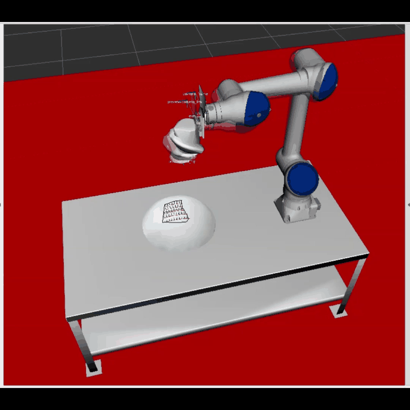

# SNP Automate 2023 抛光仿真

本仓库用于实现 **SNP Automate 2023 抛光仿真 Demo**。项目基于 ROS 2 Jazzy 和 Docker，在仿真模式下完成：

```text
机器人扫描运动规划
→ 仿真扫描执行
→ 工业重建，生成 results_mesh.ply
→ 在 RViz 中选择待加工区域
→ 设置 TPP Start Point
→ 生成工具路径
→ 生成机器人运动规划
→ 仿真执行抛光轨迹
```

> 这是仿真 Demo，不连接真实机器人，也不会产生真实的抛光加工。

## 展示

本项目的实际运行演示视频：



完整 MP4 视频： [polishing_demo_2026-08-21.mp4](docs/videos/polishing_demo_2026-08-21.mp4)

## 环境

- Ubuntu 24.04（WSL 2 可用）
- ROS 2 Jazzy（本 Demo 不需要额外安装 ROS 2 Humble）
- Docker / Docker Compose
- 可用的图形显示转发（Ubuntu 桌面或 Windows WSLg）
- Docker 镜像：`ghcr.io/ros-industrial-consortium/snp_automate_2023:jazzy-master`

## 快速启动

在 Ubuntu-24.04 WSL 中进入仓库目录：

```bash
cd ~/snp-automate-2023-polishing-simulation
chmod +x scripts/*.sh
./scripts/run_simulation.sh
```

Windows 用户可以先进入 WSL：

```powershell
wsl.exe -d Ubuntu-24.04
```

如果关闭了 RViz，重启整个 Demo：

```bash
./scripts/restart_demo.sh
```

## 操作流程

详细的逐按钮流程见 [docs/RUN_GUIDE_CN.md](docs/RUN_GUIDE_CN.md)。核心步骤如下：

1. 在 SNPApplication 中执行初始化和扫描流程。
2. 扫描完成后确认生成了 `runtime/snp_home/snp/meshes/results_mesh.ply`。
3. 在 RViz 的 TPP/多边形工具中圈选待加工区域，并设置 **Start Point**。
4. 点击 Plan Tool Paths，直到日志显示 `Plan Tool Paths -> SUCCESS`。
5. Approve Motion Plan Generation，等待 `GenerateMotionPlanService -> SUCCESS`。
6. Approve Process Motion Execution，观察仿真机器人执行轨迹。

## 目录说明

- `config/`：SNP、RViz、机器人和工具路径规划参数。
- `launch/`：启动文件；`launch/test.launch.xml` 保留了本次仿真中用于改善初始关节状态的零位参数。
- `meshes/`：原项目工作台、工具和扫描模型资源。
- `runtime/snp_home/snp/meshes/results_mesh.ply`：本次仿真生成的重建模型。
- `runtime/results_mesh_view.blend`：用于查看重建结果的 Blender 文件。
- `docker/compose.sim.yml`：自包含仿真 Compose 配置。
- `scripts/`：启动和重启脚本。
- `docs/`：中文运行指南、故障排查、结果说明及资源清单。

## 清理本机资源

本仓库不会保存 Docker 镜像本身。镜像首次启动时会下载，约占用 13.6 GB；删除时请通过 Docker 删除容器和镜像，不要手动删除 Docker Desktop 的 WSL 虚拟磁盘：

```bash
docker rm -f snp_automate_2023_sim
docker image rm ghcr.io/ros-industrial-consortium/snp_automate_2023:jazzy-master
```

完整路径记录见 [docs/SNP_DEMO_RESOURCE_LEDGER.md](docs/SNP_DEMO_RESOURCE_LEDGER.md)。

## 来源

原始项目：`ros-industrial-consortium/snp_automate_2023`。本仓库是实习交接副本，保留原项目许可证和源码，并补充了本次实际仿真运行的配置、结果和说明。

## ROS 2 Control 模拟硬件模式

如需观察 RViz 中的虚拟机械臂按照规划轨迹运动，使用仓库提供的专用启动脚本：

```bash
./scripts/run_ros2_control_simulation.sh
```

该脚本通过 `docker/compose.ros2_control.override.yml` 将 `SNP_BYPASS_EXECUTION` 设置为 `false`，启动 `ros2_control_node`、`joint_trajectory_position_controller` 和 `joint_state_broadcaster`。该模式仍是虚拟仿真，不连接真实机器人。

完整项目流程见 [docs/PROJECT_WORKFLOW_CN.md](docs/PROJECT_WORKFLOW_CN.md)。
