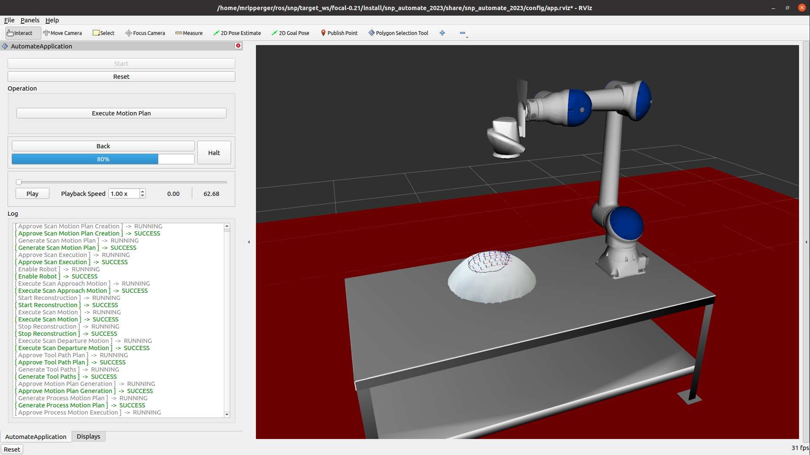

# SNP Implementation at Automate 2023

This demo uses a Motoman HC10 mounted on a table with an Intel RealSense camera to reconstruct the surface of an arbitrary part and generate motion plans for polishing parts in a raster pattern



## Run
Run the application from a pre-built Docker image using the following commands:

### On hardware
```commandLine
cd docker
docker compose up
```

### In simulation
First create the file `docker-compose.override.yml` in the `docker` directory with the following content:

```yaml
services:
  snp_automate_2023:
    environment:
      SNP_SIM_ROBOT: true
      SNP_SIM_VISION: true
```

Then bring up the application using `docker-compose`

```commandLine
cd docker
docker compose up
```

## Local build

1. Follow the [build setup instructions](https://github.com/ros-industrial-consortium/scan_n_plan_workshop#build-setup) for the main repository
1. Clone the application-specific ROS2 dependencies into the same workspace
    ```commandLine
    cd <snp_workspace>
    vcs import src < snp_automate_2023/dependencies.repos
    ```
1. Build
    ```commandLine
    colcon build --cmake-args -DTESSERACT_BUILD_FCL=OFF
    ```
1. Run the application
    ```commandLine
    cd <snp_workspace>
    source install/setup.bash
    ros2 launch snp_automate_2023 start.launch.xml sim_robot:=<true|false> sim_vision:=<true|false>
    ```

## Hardware Configuration
### MotoROS2

Install MotoROS2 on the robot controller, following the [instructions on the MotoROS2 repository](https://github.com/Yaskawa-Global/motoros2?tab=readme-ov-file#installation).

> Be sure to install the same version of MotoROS2 as the version of the `motoros2_interfaces` package defined in the [`dependencies.repos` file](dependencies.repos#L8).

### Camera extrinsic hand-eye calibration

Launch the camera extrinsic calibration application using Docker:

```commandLine
cd snp_automate_2023
docker compose -f docker/calibration.docker-compose.yml
```

> Note: this Docker application mounts the directory `$HOME/snp/calibration` and will save the calibration data and results into this directory.

Move the robot through 10-15 view poses observing a calibration target.
Use the Rviz calibration panel to collect calibration observations and save them to file, perform the calibration, and save the calibration results to file.
When complete, overwrite the [calibration.yaml](../config/calibration.yaml) file with the new calibration results file, and then launch the nominal application.
